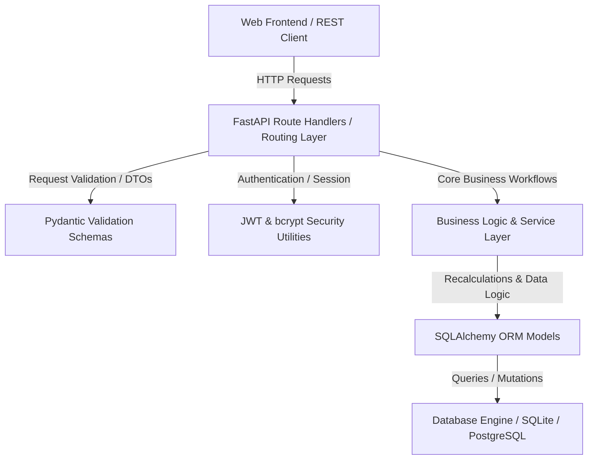
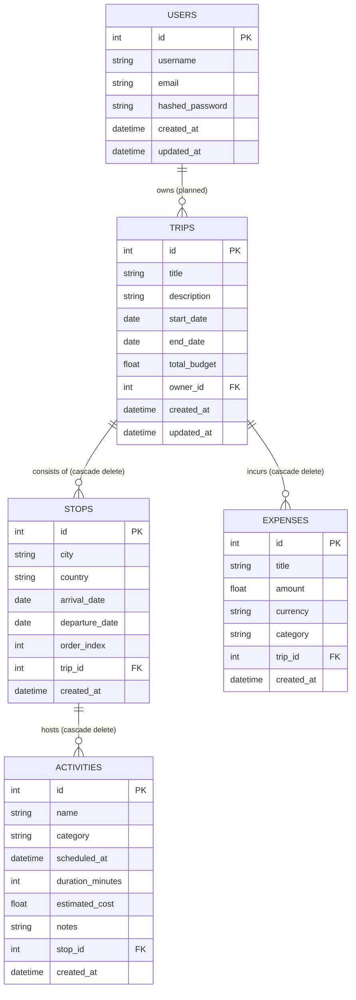

# 🌍 ZUno — Premium Multi-City Travel Itinerary Management Platform

Welcome to **ZUno (formerly Traveloop)**, a premium, modern, and high-performance travel itinerary management application. ZUno helps travelers effortlessly design multi-city journeys, schedule experiences, optimize travel routes, and maintain full budget visibility through beautifully designed dashboards and high-speed backend architecture.

This repository features a modern, modular, and enterprise-grade Python backend built on top of **FastAPI**, **SQLAlchemy**, and **SQLite/PostgreSQL**, perfectly decoupled to power our sleek dark-mode glassmorphic frontends.

---

## 🏗 Backend System Architecture

The ZUno backend is designed around a **Clean Architecture** pattern, splitting core concerns into isolated layers to maximize testability, scalability, and maintainability:



### 📂 Directory Walkthrough

```
backend/
├── app/
│   ├── main.py              # Application root & API router registration
│   ├── config/
│   │   └── settings.py      # Pydantic BaseSettings environment-variable injector
│   ├── database/
│   │   ├── database.py      # SQLAlchemy connection engine & Declarative Base
│   │   └── session.py       # Scoped SessionLocal factory & get_db dependency injection
│   ├── models/              # Declarative SQLAlchemy ORM Domain Models
│   │   ├── user.py          # User management schema
│   │   ├── trip.py          # Multi-city trip aggregates
│   │   ├── stop.py          # Intermediate destination cities
│   │   ├── activity.py      # Experiences & itinerary items
│   │   └── expense.py       # Cost tracking entities
│   ├── schemas/             # Strict Pydantic v2 Request/Response serialization DTOs
│   ├── routes/              # FastAPI Router resource endpoints (REST API)
│   ├── services/            # Pure Business logic & recalculation services
│   └── utils/               # JWT tokenization, crypt-hashing, & shared constants
├── requirements.txt         # Production & Development dependencies
├── Dockerfile               # Productionized Docker multi-stage configuration
├── .env.example             # Clean template of configurable environment variables
└── README.md                # Local backend summary
```

---

## 💾 Relational Database Schema & Entities

The data layer models a rich, structured relationship tree supporting deep cascaded operations. By default, it operates on a SQLite instance for zero-config onboarding, while natively supporting PostgreSQL connection strings.



- **Users (`users` table)**: Secure credentials, utilizing secure salting/hashing.
- **Trips (`trips` table)**: Represents the top-level container of a travel itinerary. Has a dynamic `total_budget` field that acts as a real-time calculated aggregate.
- **Stops (`stops` table)**: Represents cities visited on a trip, ordered sequentially via `order_index`.
- **Activities (`activities` table)**: Specific experiences inside a stop, including scheduling detail, category classifications, and optional estimated costs.
- **Expenses (`expenses` table)**: Realized purchases logged against a Trip, powering real-time analytics.

---

## ⚡ API Endpoint Reference

All response bodies are strict Pydantic models automatically documented via Swagger/OpenAPI.

### 🔑 Authentication
| Method | Endpoint | Description | Request Body | Auth Required |
| :--- | :--- | :--- | :--- | :---: |
| `POST` | `/api/auth/register` | Register a new user | `UserCreate` | No |
| `POST` | `/api/auth/login` | Authenticate & acquire Bearer JWT token | `UserLogin` | No |

### ✈️ Trips (Itinerary Containers)
| Method | Endpoint | Description | Request/Response | Auth Required |
| :--- | :--- | :--- | :--- | :---: |
| `POST` | `/api/trips/` | Create a new trip | `TripCreate` ➔ `TripResponse` | Optional |
| `GET` | `/api/trips/` | Fetch all trips | `List[TripResponse]` | Optional |
| `GET` | `/api/trips/{trip_id}` | Fetch a specific trip details | `TripResponse` | Optional |
| `PUT` | `/api/trips/{trip_id}` | Update trip headers/budgets | `TripUpdate` ➔ `TripResponse` | Optional |
| `DELETE` | `/api/trips/{trip_id}` | Delete a trip (cascades stops/expenses) | `204 No Content` | Optional |

### 📍 Stops (Cities)
| Method | Endpoint | Description | Request/Response |
| :--- | :--- | :--- | :--- |
| `POST` | `/api/stops/` | Add a new city to a trip | `StopCreate` ➔ `StopResponse` |
| `GET` | `/api/stops/trip/{trip_id}` | List all stops within a trip ordered by `order_index` | `List[StopResponse]` |
| `PUT` | `/api/stops/{stop_id}` | Modify stop durations/city/ordering | `StopUpdate` ➔ `StopResponse` |
| `DELETE` | `/api/stops/{stop_id}` | Delete a stop from itinerary (cascades activities) | `204 No Content` |

### 🎭 Activities (Experiences)
| Method | Endpoint | Description | Request/Response |
| :--- | :--- | :--- | :--- |
| `POST` | `/api/activities/` | Add an event to a stop | `ActivityCreate` ➔ `ActivityResponse` |
| `GET` | `/api/activities/stop/{stop_id}` | Fetch all activities in a stop | `List[ActivityResponse]` |
| `PUT` | `/api/activities/{activity_id}` | Edit schedule/costs/details | `ActivityUpdate` ➔ `ActivityResponse` |
| `DELETE` | `/api/activities/{activity_id}` | Remove activity from stop | `204 No Content` |

### 💵 Expenses & Budget
| Method | Endpoint | Description | Request/Response |
| :--- | :--- | :--- | :--- |
| `POST` | `/api/expenses/` | Log an expense (Triggers budget recalculation) | `ExpenseCreate` ➔ `ExpenseResponse` |
| `GET` | `/api/expenses/trip/{trip_id}` | Retrieve all logged expenses of a trip | `List[ExpenseResponse]` |
| `PUT` | `/api/expenses/{expense_id}` | Modify expense headers or amounts | `ExpenseUpdate` ➔ `ExpenseResponse` |
| `DELETE` | `/api/expenses/{expense_id}` | Delete an expense item | `204 No Content` |

---

## 🛠 Business Service Layers

ZUno incorporates a dedicated service layer that encapsulates advanced workflow computations:

1. **`BudgetService` (`app/services/budget_service.py`)**:
   - Computes dynamic live-budgets.
   - Automatically aggregates both **explicit realized expenses** and **estimated activity costs** whenever write/delete mutations happen across the schema, ensuring the owner has up-to-date indicators.
   - Groups metrics into real-time categories (e.g. Transport, Lodging, Activities, Food) for interactive donut charts.
2. **`ValidationService` (`app/services/validation_service.py`)**:
   - Beyond boundary validation, it validates operational invariants such as checking whether flight/hotel booking boundaries match overall trip start/end date ranges.
   - Asserts distinct sequential non-colliding order indices for stops.
3. **`RouteService` & `RecommendationService` (Future Modules)**:
   - Contains structural patterns ready to plug in Mapping APIs (Distance-Matrix) and Travelling Salesperson heuristics for multi-city routing optimizations.

---

## 🚀 Setting Up the Application

### Prerequisites
- Python `3.10` or higher
- SQLite (pre-installed in most systems) or a live PostgreSQL server

### Local Quick-Start Setup

1. **Navigate to the Backend Directory**:
   ```bash
   cd backend
   ```

2. **Establish a Clean Virtual Environment**:
   ```bash
   # Create environment
   python -m venv venv
   
   # Activate environment
   # Windows PowerShell:
   .\venv\Scripts\Activate.ps1
   # Linux/macOS:
   source venv/bin/activate
   ```

3. **Install Dependencies**:
   ```bash
   pip install --upgrade pip
   pip install -r requirements.txt
   ```

4. **Environment Initialization**:
   Create a `.env` file from the sample:
   ```bash
   cp .env.example .env
   ```
   *For default development, the fallback `DATABASE_URL` will spin up local `traveloop.db` SQLite database in the root automatically.*

5. **Start Dev Server**:
   ```bash
   uvicorn app.main:app --reload
   ```
   - Development Server: [http://127.0.0.1:8000](http://127.0.0.1:8000)
   - Interactive OpenAPI/Swagger Docs: [http://127.0.0.1:8000/docs](http://127.0.0.1:8000/docs)
   - Alternative Redoc Docs: [http://127.0.0.1:8000/redoc](http://127.0.0.1:8000/redoc)

---

## 🐳 Docker Deployment

The application features a fully production-ready Docker setup.

```bash
# Build the Image
docker build -t zuno-backend .

# Run the Container with Environment Configuration
docker run -d -p 8000:8000 --env-file .env --name zuno-api zuno-backend
```

---

## 🛡 Security & Authentication Best Practices

- **Password Hashing**: Done via `passlib` with standard `bcrypt` hashing algorithms. No plain-text passwords ever touch storage.
- **JWT Cryptography**: State-based signed tokens using `HS256` symmetric algorithms.
- **CORS Handling**: Native Middleware enabling granular origin controls, fully prepared for isolated cloud-frontend deployment.

---

## 📈 Quality Assurance & Tests

Tests are orchestrated with `pytest` and `httpx` to validate complete API routers end-to-end:

```bash
# Run backend test suite
pytest
```
